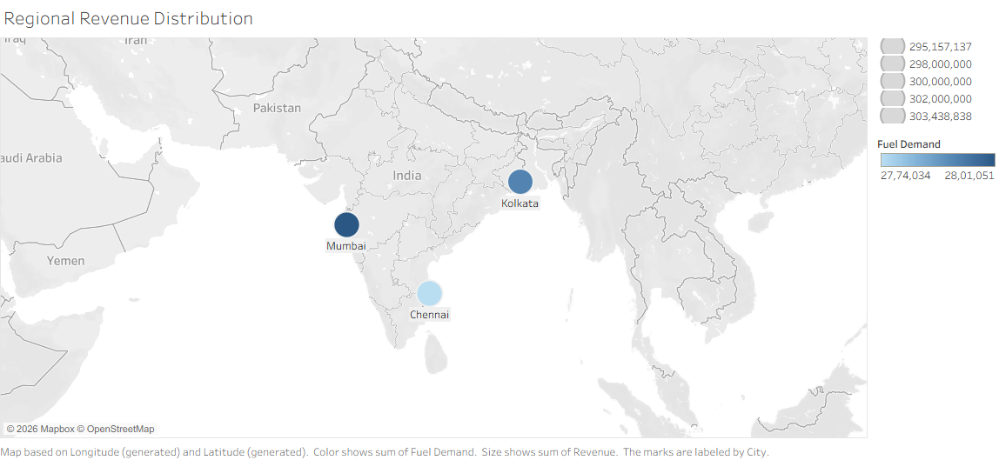

# Crude Oil Price and Inflation Analysis

## Objective
Analyze crude oil price fluctuations and their impact using data analysis and visualization methods.

## Tools Used
- Tableau
- Excel
- Statistics

## Dataset
- Oil city dataset
- Revenue analysis data

## Methodology
1. Data collection
2. Data cleaning
3. Visualization
4. Trend analysis

## Findings
- Studied regional revenue distribution
- Compared economic trends
- Created dashboard visualization

## Output
- Dashboard image
- Analysis report
- Dataset

## Dashboard Preview

